# Project Map

This file was generated automatically by `project_mapper.py`.
Use it to help AI coding tools understand the codebase before making changes.

## Project Summary

- Root: `/Users/gowtham/Desktop/lectureforge-ai`
- Files scanned: `98`
- Dependency edges found: `57`
- Entry points found: `3`

## Generated Outputs

- Architecture report: `ARCHITECTURE_REPORT.md`
- Mermaid graph: `PROJECT_DEPENDENCIES.mmd`
- Graphviz DOT graph: `PROJECT_GRAPH.dot`
- Interactive graph: `PROJECT_GRAPH.html`
- Graph image: `PROJECT_GRAPH.png`
- SVG graph: `PROJECT_GRAPH.svg`
- Raw graph data: `project_map.json`

## Suggested AI Instruction

> Read `ARCHITECTURE_REPORT.md` and `PROJECT_MAP.md` first. Then inspect the relevant source files before editing code. Preserve working behavior and avoid changing unrelated files.

## Entry Points

- `lectureforge-backend/main.py`
- `lectureforge-frontend/src/App.jsx`
- `lectureforge-frontend/src/main.jsx`

## High-Level Dependency Graph

```mermaid
graph TD
    N1["lectureforge-backend/agents/agent1_ingestion.py"] --> N2["lectureforge-backend/models/__init__.py"]
    N1["lectureforge-backend/agents/agent1_ingestion.py"] --> N3["lectureforge-backend/models/schemas.py"]
    N1["lectureforge-backend/agents/agent1_ingestion.py"] --> N4["lectureforge-backend/utils/__init__.py"]
    N1["lectureforge-backend/agents/agent1_ingestion.py"] --> N5["lectureforge-backend/utils/transcript_utils.py"]
    N6["lectureforge-backend/agents/agent2_analysis.py"] --> N2["lectureforge-backend/models/__init__.py"]
    N6["lectureforge-backend/agents/agent2_analysis.py"] --> N3["lectureforge-backend/models/schemas.py"]
    N6["lectureforge-backend/agents/agent2_analysis.py"] --> N7["lectureforge-backend/services/__init__.py"]
    N6["lectureforge-backend/agents/agent2_analysis.py"] --> N8["lectureforge-backend/services/openai_service.py"]
    N6["lectureforge-backend/agents/agent2_analysis.py"] --> N4["lectureforge-backend/utils/__init__.py"]
    N6["lectureforge-backend/agents/agent2_analysis.py"] --> N5["lectureforge-backend/utils/transcript_utils.py"]
    N9["lectureforge-backend/agents/agent3_study.py"] --> N2["lectureforge-backend/models/__init__.py"]
    N9["lectureforge-backend/agents/agent3_study.py"] --> N3["lectureforge-backend/models/schemas.py"]
    N9["lectureforge-backend/agents/agent3_study.py"] --> N7["lectureforge-backend/services/__init__.py"]
    N9["lectureforge-backend/agents/agent3_study.py"] --> N8["lectureforge-backend/services/openai_service.py"]
    N9["lectureforge-backend/agents/agent3_study.py"] --> N4["lectureforge-backend/utils/__init__.py"]
    N9["lectureforge-backend/agents/agent3_study.py"] --> N5["lectureforge-backend/utils/transcript_utils.py"]
    N10["lectureforge-backend/agents/agent4_faculty_audit.py"] --> N2["lectureforge-backend/models/__init__.py"]
    N10["lectureforge-backend/agents/agent4_faculty_audit.py"] --> N3["lectureforge-backend/models/schemas.py"]
    N10["lectureforge-backend/agents/agent4_faculty_audit.py"] --> N7["lectureforge-backend/services/__init__.py"]
    N10["lectureforge-backend/agents/agent4_faculty_audit.py"] --> N8["lectureforge-backend/services/openai_service.py"]
    N11["lectureforge-backend/main.py"] --> N12["lectureforge-backend/agents/__init__.py"]
    N11["lectureforge-backend/main.py"] --> N1["lectureforge-backend/agents/agent1_ingestion.py"]
    N11["lectureforge-backend/main.py"] --> N6["lectureforge-backend/agents/agent2_analysis.py"]
    N11["lectureforge-backend/main.py"] --> N9["lectureforge-backend/agents/agent3_study.py"]
    N11["lectureforge-backend/main.py"] --> N10["lectureforge-backend/agents/agent4_faculty_audit.py"]
    N11["lectureforge-backend/main.py"] --> N2["lectureforge-backend/models/__init__.py"]
    N11["lectureforge-backend/main.py"] --> N3["lectureforge-backend/models/schemas.py"]
    N11["lectureforge-backend/main.py"] --> N7["lectureforge-backend/services/__init__.py"]
    N11["lectureforge-backend/main.py"] --> N13["lectureforge-backend/services/job_store.py"]
    N11["lectureforge-backend/main.py"] --> N8["lectureforge-backend/services/openai_service.py"]
    N11["lectureforge-backend/main.py"] --> N4["lectureforge-backend/utils/__init__.py"]
    N11["lectureforge-backend/main.py"] --> N14["lectureforge-backend/utils/faculty_audit_validator.py"]
    N11["lectureforge-backend/main.py"] --> N15["lectureforge-backend/utils/study_kit_validator.py"]
    N11["lectureforge-backend/main.py"] --> N5["lectureforge-backend/utils/transcript_utils.py"]
    N14["lectureforge-backend/utils/faculty_audit_validator.py"] --> N2["lectureforge-backend/models/__init__.py"]
    N14["lectureforge-backend/utils/faculty_audit_validator.py"] --> N3["lectureforge-backend/models/schemas.py"]
    N15["lectureforge-backend/utils/study_kit_validator.py"] --> N2["lectureforge-backend/models/__init__.py"]
    N15["lectureforge-backend/utils/study_kit_validator.py"] --> N3["lectureforge-backend/models/schemas.py"]
    N15["lectureforge-backend/utils/study_kit_validator.py"] --> N4["lectureforge-backend/utils/__init__.py"]
    N15["lectureforge-backend/utils/study_kit_validator.py"] --> N5["lectureforge-backend/utils/transcript_utils.py"]
    N5["lectureforge-backend/utils/transcript_utils.py"] --> N2["lectureforge-backend/models/__init__.py"]
    N5["lectureforge-backend/utils/transcript_utils.py"] --> N3["lectureforge-backend/models/schemas.py"]
    N16["lectureforge-frontend/src/App.jsx"] --> N17["lectureforge-frontend/src/components/FacultyAuditDashboard.jsx"]
    N16["lectureforge-frontend/src/App.jsx"] --> N18["lectureforge-frontend/src/components/Header.jsx"]
    N16["lectureforge-frontend/src/App.jsx"] --> N19["lectureforge-frontend/src/components/ProgressCard.jsx"]
    N16["lectureforge-frontend/src/App.jsx"] --> N20["lectureforge-frontend/src/components/StudyDashboard.jsx"]
    N16["lectureforge-frontend/src/App.jsx"] --> N21["lectureforge-frontend/src/components/VideoForm.jsx"]
    N22["lectureforge-frontend/src/components/SearchTab.jsx"] --> N23["lectureforge-frontend/src/lib/api.js"]
    N20["lectureforge-frontend/src/components/StudyDashboard.jsx"] --> N24["lectureforge-frontend/src/components/ConceptMapTab.jsx"]
    N20["lectureforge-frontend/src/components/StudyDashboard.jsx"] --> N25["lectureforge-frontend/src/components/FlashcardsTab.jsx"]
    N20["lectureforge-frontend/src/components/StudyDashboard.jsx"] --> N26["lectureforge-frontend/src/components/OutlineTab.jsx"]
    N20["lectureforge-frontend/src/components/StudyDashboard.jsx"] --> N22["lectureforge-frontend/src/components/SearchTab.jsx"]
    N20["lectureforge-frontend/src/components/StudyDashboard.jsx"] --> N27["lectureforge-frontend/src/components/SummariesTab.jsx"]
    N20["lectureforge-frontend/src/components/StudyDashboard.jsx"] --> N28["lectureforge-frontend/src/components/Tabs.jsx"]
    N20["lectureforge-frontend/src/components/StudyDashboard.jsx"] --> N29["lectureforge-frontend/src/components/TranscriptTab.jsx"]
    N30["lectureforge-frontend/src/main.jsx"] --> N16["lectureforge-frontend/src/App.jsx"]
    N30["lectureforge-frontend/src/main.jsx"] --> N31["lectureforge-frontend/src/styles/index.css"]
```



## Top Hub Files

- `lectureforge-backend/main.py` total=14, incoming=0, outgoing=14 — Application entry point
- `lectureforge-backend/models/__init__.py` total=8, incoming=8, outgoing=0 — Supporting project file
- `lectureforge-backend/models/schemas.py` total=8, incoming=8, outgoing=0 — Class-based business logic or data model
- `lectureforge-frontend/src/components/StudyDashboard.jsx` total=8, incoming=1, outgoing=7 — Frontend component
- `lectureforge-backend/utils/transcript_utils.py` total=7, incoming=5, outgoing=2 — Utility/helper module
- `lectureforge-backend/agents/agent2_analysis.py` total=7, incoming=1, outgoing=6 — Streamlit user interface module
- `lectureforge-backend/agents/agent3_study.py` total=7, incoming=1, outgoing=6 — AI model integration module
- `lectureforge-frontend/src/App.jsx` total=6, incoming=1, outgoing=5 — Application entry point
- `lectureforge-backend/utils/__init__.py` total=5, incoming=5, outgoing=0 — Utility/helper module
- `lectureforge-backend/agents/agent1_ingestion.py` total=5, incoming=1, outgoing=4 — AI model integration module

## File Summaries

### `MOBILE_RELEASE.md`

- Role: Project documentation
- Type: `.md`
- Size: `3763` bytes
- Lines: `138`
- Local dependencies: none detected
- Notes:
  - May handle API keys, passwords, or secrets. Verify secrets are loaded from environment variables.
  - Reads, writes, or processes JSON-like data.

### `README.md`

- Role: Project documentation
- Type: `.md`
- Size: `18362` bytes
- Lines: `851`
- Local dependencies: none detected
- Notes:
  - May handle API keys, passwords, or secrets. Verify secrets are loaded from environment variables.
  - Reads, writes, or processes JSON-like data.

### `VERSION_NOTES.md`

- Role: Project documentation
- Type: `.md`
- Size: `587` bytes
- Lines: `31`
- Local dependencies: none detected

### `lectureforge-backend/agents/__init__.py`

- Role: Supporting project file
- Type: `.py`
- Size: `0` bytes
- Lines: `0`
- Local dependencies: none detected

### `lectureforge-backend/agents/agent1_ingestion.py`

- Role: AI model integration module
- Type: `.py`
- Size: `13467` bytes
- Lines: `445`
- Local dependencies:
  - `lectureforge-backend/models/__init__.py`
  - `lectureforge-backend/models/schemas.py`
  - `lectureforge-backend/utils/__init__.py`
  - `lectureforge-backend/utils/transcript_utils.py`
- Functions: _extract_video_id, _find_audio_file, _get_segment_value, _get_supadata_transcript, _get_transcript_api_captions, _get_youtube_captions_with_ytdlp, _parse_json3_captions, _run_command, _safe_get, _select_best_caption_file, _transcribe_with_whisper, get_transcript plus 1 more
- Classes: Agent1Ingestion
- Environment variables: OPENAI_API_KEY, SUPADATA_API_KEY
- Notes:
  - Imports 13 external or internal modules.
  - Defines 13 function(s).
  - Defines 1 class(es).
  - Uses environment variable(s): OPENAI_API_KEY, SUPADATA_API_KEY.
  - May handle API keys, passwords, or secrets. Verify secrets are loaded from environment variables.
  - Includes exception handling.

### `lectureforge-backend/agents/agent2_analysis.py`

- Role: Streamlit user interface module
- Type: `.py`
- Size: `1850` bytes
- Lines: `70`
- Local dependencies:
  - `lectureforge-backend/models/__init__.py`
  - `lectureforge-backend/models/schemas.py`
  - `lectureforge-backend/services/__init__.py`
  - `lectureforge-backend/services/openai_service.py`
  - `lectureforge-backend/utils/__init__.py`
  - `lectureforge-backend/utils/transcript_utils.py`
- Functions: analyze
- Classes: Agent2Analysis
- Notes:
  - Imports 4 external or internal modules.
  - Defines 1 function(s).
  - Defines 1 class(es).
  - Reads, writes, or processes JSON-like data.

### `lectureforge-backend/agents/agent3_study.py`

- Role: AI model integration module
- Type: `.py`
- Size: `5841` bytes
- Lines: `230`
- Local dependencies:
  - `lectureforge-backend/models/__init__.py`
  - `lectureforge-backend/models/schemas.py`
  - `lectureforge-backend/services/__init__.py`
  - `lectureforge-backend/services/openai_service.py`
  - `lectureforge-backend/utils/__init__.py`
  - `lectureforge-backend/utils/transcript_utils.py`
- Functions: _generate_bilingual_output, _generate_concept_map, _generate_flashcards, _generate_summaries, create_search_embeddings, generate_study_kit
- Classes: Agent3Study
- Notes:
  - Imports 4 external or internal modules.
  - Defines 6 function(s).
  - Defines 1 class(es).
  - Reads, writes, or processes JSON-like data.

### `lectureforge-backend/agents/agent4_faculty_audit.py`

- Role: Streamlit user interface module
- Type: `.py`
- Size: `19974` bytes
- Lines: `581`
- Local dependencies:
  - `lectureforge-backend/models/__init__.py`
  - `lectureforge-backend/models/schemas.py`
  - `lectureforge-backend/services/__init__.py`
  - `lectureforge-backend/services/openai_service.py`
- Functions: _as_list, _as_string, _default_dimension, _normalize_dimension, _normalize_highest_impact_fix, _normalize_priority_fixes, _normalize_rewrites, _safe_chunk_value, _seconds_to_timestamp, build_empty_faculty_audit_report, format_transcript_for_audit, generate_faculty_audit plus 2 more
- Notes:
  - Imports 4 external or internal modules.
  - Defines 14 function(s).
  - Includes exception handling.
  - Reads, writes, or processes JSON-like data.

### `lectureforge-backend/main.py`

- Role: Application entry point
- Type: `.py`
- Size: `37993` bytes
- Lines: `1279`
- Local dependencies:
  - `lectureforge-backend/agents/__init__.py`
  - `lectureforge-backend/agents/agent1_ingestion.py`
  - `lectureforge-backend/agents/agent2_analysis.py`
  - `lectureforge-backend/agents/agent3_study.py`
  - `lectureforge-backend/agents/agent4_faculty_audit.py`
  - `lectureforge-backend/models/__init__.py`
  - `lectureforge-backend/models/schemas.py`
  - `lectureforge-backend/services/__init__.py`
  - `lectureforge-backend/services/job_store.py`
  - `lectureforge-backend/services/openai_service.py`
  - `lectureforge-backend/utils/__init__.py`
  - `lectureforge-backend/utils/faculty_audit_validator.py`
  - `lectureforge-backend/utils/study_kit_validator.py`
  - `lectureforge-backend/utils/transcript_utils.py`
- Functions: build_public_error_message, build_translation_error_detail, build_translation_section_key, cosine_similarity, debug_env, debug_openai, extract_json_from_text, get_faculty_audit, get_job_status, get_original_section_data, get_study_kit, get_study_kit_dict plus 16 more
- Environment variables: LECTUREFORGE_CORS_ORIGINS, LECTUREFORGE_ENABLE_DEBUG_ENDPOINTS, OPENAI_API_KEY, OPENAI_EMBEDDING_MODEL, OPENAI_MODEL, SUPADATA_API_KEY
- Notes:
  - Imports 18 external or internal modules.
  - Defines 28 function(s).
  - Uses environment variable(s): LECTUREFORGE_CORS_ORIGINS, LECTUREFORGE_ENABLE_DEBUG_ENDPOINTS, OPENAI_API_KEY, OPENAI_EMBEDDING_MODEL, OPENAI_MODEL, SUPADATA_API_KEY.
  - May handle API keys, passwords, or secrets. Verify secrets are loaded from environment variables.
  - Includes exception handling.
  - Reads, writes, or processes JSON-like data.

### `lectureforge-backend/models/__init__.py`

- Role: Supporting project file
- Type: `.py`
- Size: `0` bytes
- Lines: `0`
- Local dependencies: none detected

### `lectureforge-backend/models/schemas.py`

- Role: Class-based business logic or data model
- Type: `.py`
- Size: `3656` bytes
- Lines: `177`
- Local dependencies: none detected
- Classes: AuditDimension, ConceptMap, ConceptMapEdge, ConceptMapNode, FacultyAuditReport, FacultyAuditRequest, Flashcard, HighestImpactFix, KeyConcept, LectureAnalysis, OutlineItem, PriorityFix plus 13 more
- Notes:
  - Imports 2 external or internal modules.
  - Defines 25 class(es).

### `lectureforge-backend/requirements.txt`

- Role: Dependency or project configuration file
- Type: `.txt`
- Size: `163` bytes
- Lines: `10`
- Local dependencies: none detected

### `lectureforge-backend/services/__init__.py`

- Role: Supporting project file
- Type: `.py`
- Size: `0` bytes
- Lines: `0`
- Local dependencies: none detected

### `lectureforge-backend/services/job_store.py`

- Role: Class-based business logic or data model
- Type: `.py`
- Size: `3479` bytes
- Lines: `129`
- Local dependencies: none detected
- Functions: __init__, add_translation, create_job, get_job, get_translation, get_translation_section, set_translation_section, update_job
- Classes: JobStore
- Notes:
  - Imports 1 external or internal modules.
  - Defines 8 function(s).
  - Defines 1 class(es).

### `lectureforge-backend/services/openai_service.py`

- Role: AI model integration module
- Type: `.py`
- Size: `1805` bytes
- Lines: `64`
- Local dependencies: none detected
- Functions: call_openai_json, create_embedding, create_embeddings, generate_json, generate_text
- Environment variables: OPENAI_API_KEY, OPENAI_EMBEDDING_MODEL, OPENAI_MODEL
- Notes:
  - Imports 5 external or internal modules.
  - Defines 5 function(s).
  - Uses environment variable(s): OPENAI_API_KEY, OPENAI_EMBEDDING_MODEL, OPENAI_MODEL.
  - May handle API keys, passwords, or secrets. Verify secrets are loaded from environment variables.
  - Reads, writes, or processes JSON-like data.

### `lectureforge-backend/study_kit_82186720.json`

- Role: API server or backend route module
- Type: `.json`
- Size: `35968` bytes
- Lines: `388`
- Local dependencies: none detected

### `lectureforge-backend/utils/__init__.py`

- Role: Utility/helper module
- Type: `.py`
- Size: `0` bytes
- Lines: `0`
- Local dependencies: none detected

### `lectureforge-backend/utils/faculty_audit_validator.py`

- Role: Utility/helper module
- Type: `.py`
- Size: `447` bytes
- Lines: `16`
- Local dependencies:
  - `lectureforge-backend/models/__init__.py`
  - `lectureforge-backend/models/schemas.py`
- Functions: validate_faculty_audit
- Notes:
  - Imports 1 external or internal modules.
  - Defines 1 function(s).

### `lectureforge-backend/utils/study_kit_validator.py`

- Role: Utility/helper module
- Type: `.py`
- Size: `2646` bytes
- Lines: `84`
- Local dependencies:
  - `lectureforge-backend/models/__init__.py`
  - `lectureforge-backend/models/schemas.py`
  - `lectureforge-backend/utils/__init__.py`
  - `lectureforge-backend/utils/transcript_utils.py`
- Functions: clamp_timestamp, find_best_timestamp_for_text, validate_study_kit
- Notes:
  - Imports 3 external or internal modules.
  - Defines 3 function(s).
  - Includes exception handling.

### `lectureforge-backend/utils/transcript_utils.py`

- Role: Utility/helper module
- Type: `.py`
- Size: `3659` bytes
- Lines: `142`
- Local dependencies:
  - `lectureforge-backend/models/__init__.py`
  - `lectureforge-backend/models/schemas.py`
- Functions: clean_text, format_timestamp, merge_small_chunks, plain_text_to_chunks, transcript_to_plain_text, youtube_timestamp_url
- Notes:
  - Imports 3 external or internal modules.
  - Defines 6 function(s).
  - Includes exception handling.

### `lectureforge-frontend/README.md`

- Role: Project documentation
- Type: `.md`
- Size: `610` bytes
- Lines: `42`
- Local dependencies: none detected

### `lectureforge-frontend/android/app/build.gradle`

- Role: Dependency or project configuration file
- Type: `.gradle`
- Size: `2136` bytes
- Lines: `54`
- Local dependencies: none detected
- Notes:
  - Reads, writes, or processes JSON-like data.

### `lectureforge-frontend/android/app/capacitor.build.gradle`

- Role: Supporting project file
- Type: `.gradle`
- Size: `370` bytes
- Lines: `19`
- Local dependencies: none detected

### `lectureforge-frontend/android/app/proguard-rules.pro`

- Role: Supporting project file
- Type: `.pro`
- Size: `751` bytes
- Lines: `21`
- Local dependencies: none detected

### `lectureforge-frontend/android/app/src/androidTest/java/com/getcapacitor/myapp/ExampleInstrumentedTest.java`

- Role: Test file
- Type: `.java`
- Size: `774` bytes
- Lines: `26`
- Local dependencies: none detected

### `lectureforge-frontend/android/app/src/main/AndroidManifest.xml`

- Role: Supporting project file
- Type: `.xml`
- Size: `1537` bytes
- Lines: `41`
- Local dependencies: none detected

### `lectureforge-frontend/android/app/src/main/assets/capacitor.config.json`

- Role: Configuration file
- Type: `.json`
- Size: `174` bytes
- Lines: `11`
- Local dependencies: none detected

### `lectureforge-frontend/android/app/src/main/assets/capacitor.plugins.json`

- Role: Supporting project file
- Type: `.json`
- Size: `3` bytes
- Lines: `1`
- Local dependencies: none detected

### `lectureforge-frontend/android/app/src/main/assets/public/assets/index-B_kExwk-.css`

- Role: Stylesheet
- Type: `.css`
- Size: `24088` bytes
- Lines: `1`
- Local dependencies: none detected

### `lectureforge-frontend/android/app/src/main/assets/public/cordova.js`

- Role: Supporting project file
- Type: `.js`
- Size: `0` bytes
- Lines: `0`
- Local dependencies: none detected

### `lectureforge-frontend/android/app/src/main/assets/public/cordova_plugins.js`

- Role: Supporting project file
- Type: `.js`
- Size: `0` bytes
- Lines: `0`
- Local dependencies: none detected

### `lectureforge-frontend/android/app/src/main/assets/public/index.html`

- Role: Frontend HTML entry file
- Type: `.html`
- Size: `400` bytes
- Lines: `13`
- Local dependencies: none detected

### `lectureforge-frontend/android/app/src/main/java/com/lectureforge/ai/MainActivity.java`

- Role: Supporting project file
- Type: `.java`
- Size: `123` bytes
- Lines: `5`
- Local dependencies: none detected

### `lectureforge-frontend/android/app/src/main/res/drawable-v24/ic_launcher_foreground.xml`

- Role: Supporting project file
- Type: `.xml`
- Size: `1880` bytes
- Lines: `34`
- Local dependencies: none detected

### `lectureforge-frontend/android/app/src/main/res/drawable/ic_launcher_background.xml`

- Role: Supporting project file
- Type: `.xml`
- Size: `5606` bytes
- Lines: `170`
- Local dependencies: none detected

### `lectureforge-frontend/android/app/src/main/res/layout/activity_main.xml`

- Role: Supporting project file
- Type: `.xml`
- Size: `535` bytes
- Lines: `12`
- Local dependencies: none detected

### `lectureforge-frontend/android/app/src/main/res/mipmap-anydpi-v26/ic_launcher.xml`

- Role: Supporting project file
- Type: `.xml`
- Size: `265` bytes
- Lines: `5`
- Local dependencies: none detected

### `lectureforge-frontend/android/app/src/main/res/mipmap-anydpi-v26/ic_launcher_round.xml`

- Role: Supporting project file
- Type: `.xml`
- Size: `265` bytes
- Lines: `5`
- Local dependencies: none detected

### `lectureforge-frontend/android/app/src/main/res/values/ic_launcher_background.xml`

- Role: Supporting project file
- Type: `.xml`
- Size: `120` bytes
- Lines: `4`
- Local dependencies: none detected

### `lectureforge-frontend/android/app/src/main/res/values/strings.xml`

- Role: Supporting project file
- Type: `.xml`
- Size: `308` bytes
- Lines: `7`
- Local dependencies: none detected

### `lectureforge-frontend/android/app/src/main/res/values/styles.xml`

- Role: Supporting project file
- Type: `.xml`
- Size: `823` bytes
- Lines: `22`
- Local dependencies: none detected

### `lectureforge-frontend/android/app/src/main/res/xml/config.xml`

- Role: Configuration file
- Type: `.xml`
- Size: `185` bytes
- Lines: `6`
- Local dependencies: none detected

### `lectureforge-frontend/android/app/src/main/res/xml/file_paths.xml`

- Role: Supporting project file
- Type: `.xml`
- Size: `213` bytes
- Lines: `5`
- Local dependencies: none detected

### `lectureforge-frontend/android/app/src/test/java/com/getcapacitor/myapp/ExampleUnitTest.java`

- Role: Test file
- Type: `.java`
- Size: `402` bytes
- Lines: `18`
- Local dependencies: none detected

### `lectureforge-frontend/android/build.gradle`

- Role: Dependency or project configuration file
- Type: `.gradle`
- Size: `637` bytes
- Lines: `29`
- Local dependencies: none detected

### `lectureforge-frontend/android/capacitor-cordova-android-plugins/build.gradle`

- Role: Dependency or project configuration file
- Type: `.gradle`
- Size: `1668` bytes
- Lines: `59`
- Local dependencies: none detected

### `lectureforge-frontend/android/capacitor-cordova-android-plugins/cordova.variables.gradle`

- Role: Supporting project file
- Type: `.gradle`
- Size: `312` bytes
- Lines: `7`
- Local dependencies: none detected

### `lectureforge-frontend/android/capacitor-cordova-android-plugins/src/main/AndroidManifest.xml`

- Role: Supporting project file
- Type: `.xml`
- Size: `210` bytes
- Lines: `8`
- Local dependencies: none detected

### `lectureforge-frontend/android/capacitor.settings.gradle`

- Role: Supporting project file
- Type: `.gradle`
- Size: `207` bytes
- Lines: `3`
- Local dependencies: none detected

### `lectureforge-frontend/android/gradle.properties`

- Role: Supporting project file
- Type: `.properties`
- Size: `987` bytes
- Lines: `22`
- Local dependencies: none detected

### `lectureforge-frontend/android/gradle/wrapper/gradle-wrapper.properties`

- Role: Supporting project file
- Type: `.properties`
- Size: `253` bytes
- Lines: `7`
- Local dependencies: none detected

### `lectureforge-frontend/android/gradlew`

- Role: API server or backend route module
- Type: `no extension`
- Size: `8733` bytes
- Lines: `251`
- Local dependencies: none detected

### `lectureforge-frontend/android/gradlew.bat`

- Role: API server or backend route module
- Type: `.bat`
- Size: `2937` bytes
- Lines: `94`
- Local dependencies: none detected

### `lectureforge-frontend/android/settings.gradle`

- Role: Supporting project file
- Type: `.gradle`
- Size: `208` bytes
- Lines: `5`
- Local dependencies: none detected

### `lectureforge-frontend/android/variables.gradle`

- Role: Supporting project file
- Type: `.gradle`
- Size: `498` bytes
- Lines: `16`
- Local dependencies: none detected

### `lectureforge-frontend/capacitor.config.json`

- Role: Configuration file
- Type: `.json`
- Size: `185` bytes
- Lines: `11`
- Local dependencies: none detected

### `lectureforge-frontend/index.html`

- Role: Frontend HTML entry file
- Type: `.html`
- Size: `302` bytes
- Lines: `12`
- Local dependencies: none detected

### `lectureforge-frontend/ios/App/App.xcodeproj/project.pbxproj`

- Role: Streamlit user interface module
- Type: `.pbxproj`
- Size: `14489` bytes
- Lines: `376`
- Local dependencies: none detected
- Notes:
  - Reads, writes, or processes JSON-like data.

### `lectureforge-frontend/ios/App/App.xcodeproj/project.xcworkspace/xcshareddata/IDEWorkspaceChecks.plist`

- Role: Supporting project file
- Type: `.plist`
- Size: `238` bytes
- Lines: `8`
- Local dependencies: none detected

### `lectureforge-frontend/ios/App/App/AppDelegate.swift`

- Role: Supporting project file
- Type: `.swift`
- Size: `3031` bytes
- Lines: `49`
- Local dependencies: none detected

### `lectureforge-frontend/ios/App/App/Assets.xcassets/AppIcon.appiconset/Contents.json`

- Role: Supporting project file
- Type: `.json`
- Size: `218` bytes
- Lines: `14`
- Local dependencies: none detected

### `lectureforge-frontend/ios/App/App/Assets.xcassets/Contents.json`

- Role: Supporting project file
- Type: `.json`
- Size: `62` bytes
- Lines: `6`
- Local dependencies: none detected

### `lectureforge-frontend/ios/App/App/Assets.xcassets/Splash.imageset/Contents.json`

- Role: Supporting project file
- Type: `.json`
- Size: `403` bytes
- Lines: `23`
- Local dependencies: none detected

### `lectureforge-frontend/ios/App/App/Base.lproj/LaunchScreen.storyboard`

- Role: Supporting project file
- Type: `.storyboard`
- Size: `1994` bytes
- Lines: `32`
- Local dependencies: none detected

### `lectureforge-frontend/ios/App/App/Base.lproj/Main.storyboard`

- Role: Supporting project file
- Type: `.storyboard`
- Size: `1019` bytes
- Lines: `19`
- Local dependencies: none detected

### `lectureforge-frontend/ios/App/App/Info.plist`

- Role: Supporting project file
- Type: `.plist`
- Size: `1687` bytes
- Lines: `51`
- Local dependencies: none detected

### `lectureforge-frontend/ios/App/App/capacitor.config.json`

- Role: Configuration file
- Type: `.json`
- Size: `199` bytes
- Lines: `12`
- Local dependencies: none detected

### `lectureforge-frontend/ios/App/App/config.xml`

- Role: Configuration file
- Type: `.xml`
- Size: `185` bytes
- Lines: `6`
- Local dependencies: none detected

### `lectureforge-frontend/ios/App/App/public/assets/index-B_kExwk-.css`

- Role: Stylesheet
- Type: `.css`
- Size: `24088` bytes
- Lines: `1`
- Local dependencies: none detected

### `lectureforge-frontend/ios/App/App/public/cordova.js`

- Role: Supporting project file
- Type: `.js`
- Size: `0` bytes
- Lines: `0`
- Local dependencies: none detected

### `lectureforge-frontend/ios/App/App/public/cordova_plugins.js`

- Role: Supporting project file
- Type: `.js`
- Size: `0` bytes
- Lines: `0`
- Local dependencies: none detected

### `lectureforge-frontend/ios/App/App/public/index.html`

- Role: Frontend HTML entry file
- Type: `.html`
- Size: `400` bytes
- Lines: `13`
- Local dependencies: none detected

### `lectureforge-frontend/ios/App/CapApp-SPM/Package.swift`

- Role: Supporting project file
- Type: `.swift`
- Size: `698` bytes
- Lines: `25`
- Local dependencies: none detected

### `lectureforge-frontend/ios/App/CapApp-SPM/README.md`

- Role: Project documentation
- Type: `.md`
- Size: `162` bytes
- Lines: `5`
- Local dependencies: none detected

### `lectureforge-frontend/ios/App/CapApp-SPM/Sources/CapApp-SPM/CapApp-SPM.swift`

- Role: Supporting project file
- Type: `.swift`
- Size: `33` bytes
- Lines: `1`
- Local dependencies: none detected

### `lectureforge-frontend/ios/capacitor-cordova-ios-plugins/CordovaPluginsResources.podspec`

- Role: Supporting project file
- Type: `.podspec`
- Size: `379` bytes
- Lines: `10`
- Local dependencies: none detected

### `lectureforge-frontend/ios/debug.xcconfig`

- Role: Configuration file
- Type: `.xcconfig`
- Size: `23` bytes
- Lines: `1`
- Local dependencies: none detected

### `lectureforge-frontend/package.json`

- Role: Dependency or project configuration file
- Type: `.json`
- Size: `1005` bytes
- Lines: `34`
- Local dependencies: none detected

### `lectureforge-frontend/postcss.config.js`

- Role: Configuration file
- Type: `.js`
- Size: `81` bytes
- Lines: `6`
- Local dependencies: none detected

### `lectureforge-frontend/src/App.jsx`

- Role: Application entry point
- Type: `.jsx`
- Size: `15344` bytes
- Lines: `548`
- Local dependencies:
  - `lectureforge-frontend/src/components/FacultyAuditDashboard.jsx`
  - `lectureforge-frontend/src/components/Header.jsx`
  - `lectureforge-frontend/src/components/ProgressCard.jsx`
  - `lectureforge-frontend/src/components/StudyDashboard.jsx`
  - `lectureforge-frontend/src/components/VideoForm.jsx`
- Functions: App, handleLanguageChange, handleModeChange, handleProcessVideo, normalizeTranslatedSectionData, pollJobStatus, structuredCloneSafe, translateTranscriptInBatches
- Notes:
  - Imports 6 external or internal modules.
  - Defines 8 function(s).
  - Reads, writes, or processes JSON-like data.

### `lectureforge-frontend/src/components/ConceptMapTab.jsx`

- Role: Frontend component
- Type: `.jsx`
- Size: `2043` bytes
- Lines: `85`
- Local dependencies: none detected
- Functions: ConceptMapTab, buildLayout
- Notes:
  - Imports 1 external or internal modules.
  - Defines 2 function(s).

### `lectureforge-frontend/src/components/FacultyAuditDashboard.jsx`

- Role: Frontend component
- Type: `.jsx`
- Size: `13444` bytes
- Lines: `487`
- Local dependencies: none detected
- Functions: DimensionSection, EmptyState, FacultyAuditDashboard, ListCard, TextBlock, buildMarkdownReport, downloadReport, formatDimensionForMarkdown
- Notes:
  - Imports 1 external or internal modules.
  - Defines 8 function(s).

### `lectureforge-frontend/src/components/FlashcardsTab.jsx`

- Role: Frontend component
- Type: `.jsx`
- Size: `4334` bytes
- Lines: `137`
- Local dependencies: none detected
- Functions: FlashcardsTab, buildYouTubeJumpUrl, formatTime, toggleCard
- Notes:
  - Imports 2 external or internal modules.
  - Defines 4 function(s).

### `lectureforge-frontend/src/components/Header.jsx`

- Role: Frontend component
- Type: `.jsx`
- Size: `1055` bytes
- Lines: `26`
- Local dependencies: none detected
- Functions: Header
- Notes:
  - Imports 2 external or internal modules.
  - Defines 1 function(s).

### `lectureforge-frontend/src/components/OutlineTab.jsx`

- Role: Frontend component
- Type: `.jsx`
- Size: `3208` bytes
- Lines: `105`
- Local dependencies: none detected
- Functions: OutlineTab, buildYouTubeJumpUrl, formatTime
- Notes:
  - Imports 2 external or internal modules.
  - Defines 3 function(s).

### `lectureforge-frontend/src/components/ProgressCard.jsx`

- Role: Frontend component
- Type: `.jsx`
- Size: `2248` bytes
- Lines: `65`
- Local dependencies: none detected
- Functions: ProgressCard
- Notes:
  - Imports 2 external or internal modules.
  - Defines 1 function(s).

### `lectureforge-frontend/src/components/SearchTab.jsx`

- Role: Frontend component
- Type: `.jsx`
- Size: `6624` bytes
- Lines: `203`
- Local dependencies:
  - `lectureforge-frontend/src/lib/api.js`
- Functions: SearchTab, buildYouTubeJumpUrl, formatTime, handleSearch
- Notes:
  - Imports 3 external or internal modules.
  - Defines 4 function(s).

### `lectureforge-frontend/src/components/StudyDashboard.jsx`

- Role: Frontend component
- Type: `.jsx`
- Size: `6718` bytes
- Lines: `220`
- Local dependencies:
  - `lectureforge-frontend/src/components/ConceptMapTab.jsx`
  - `lectureforge-frontend/src/components/FlashcardsTab.jsx`
  - `lectureforge-frontend/src/components/OutlineTab.jsx`
  - `lectureforge-frontend/src/components/SearchTab.jsx`
  - `lectureforge-frontend/src/components/SummariesTab.jsx`
  - `lectureforge-frontend/src/components/Tabs.jsx`
  - `lectureforge-frontend/src/components/TranscriptTab.jsx`
- Functions: StudyDashboard, TranslationProgressList, formatTranslationStatus, getTranslationStatusClass
- Notes:
  - Imports 9 external or internal modules.
  - Defines 4 function(s).

### `lectureforge-frontend/src/components/SummariesTab.jsx`

- Role: Frontend component
- Type: `.jsx`
- Size: `1101` bytes
- Lines: `36`
- Local dependencies: none detected
- Functions: SummariesTab
- Notes:
  - Imports 1 external or internal modules.
  - Defines 1 function(s).

### `lectureforge-frontend/src/components/Tabs.jsx`

- Role: Frontend component
- Type: `.jsx`
- Size: `943` bytes
- Lines: `29`
- Local dependencies: none detected
- Functions: Tabs
- Notes:
  - Imports 1 external or internal modules.
  - Defines 1 function(s).

### `lectureforge-frontend/src/components/TranscriptTab.jsx`

- Role: Frontend component
- Type: `.jsx`
- Size: `567` bytes
- Lines: `18`
- Local dependencies: none detected
- Functions: TranscriptTab
- Notes:
  - Imports 1 external or internal modules.
  - Defines 1 function(s).

### `lectureforge-frontend/src/components/VideoForm.jsx`

- Role: Frontend component
- Type: `.jsx`
- Size: `1911` bytes
- Lines: `56`
- Local dependencies: none detected
- Functions: VideoForm, handleSubmit
- Notes:
  - Imports 1 external or internal modules.
  - Defines 2 function(s).

### `lectureforge-frontend/src/lib/api.js`

- Role: Reusable logic module
- Type: `.js`
- Size: `4225` bytes
- Lines: `185`
- Local dependencies: none detected
- Functions: getErrorMessage, getFacultyAudit, getJobStatus, getStudyKit, processFacultyAudit, processFacultyAuditFromStudyKit, processVideo, searchStudyKit, translateSection, translateStudyKit
- Environment variables: VITE_API_BASE_URL
- Notes:
  - Defines 10 function(s).
  - Uses environment variable(s): VITE_API_BASE_URL.
  - Reads, writes, or processes JSON-like data.

### `lectureforge-frontend/src/main.jsx`

- Role: Application entry point
- Type: `.jsx`
- Size: `281` bytes
- Lines: `11`
- Local dependencies:
  - `lectureforge-frontend/src/App.jsx`
  - `lectureforge-frontend/src/styles/index.css`
- Notes:
  - Imports 5 external or internal modules.

### `lectureforge-frontend/src/styles/index.css`

- Role: Stylesheet
- Type: `.css`
- Size: `601` bytes
- Lines: `34`
- Local dependencies: none detected

### `lectureforge-frontend/tailwind.config.js`

- Role: Configuration file
- Type: `.js`
- Size: `248` bytes
- Lines: `12`
- Local dependencies: none detected

### `lectureforge-frontend/vite.config.js`

- Role: Configuration file
- Type: `.js`
- Size: `134` bytes
- Lines: `6`
- Local dependencies: none detected
- Notes:
  - Imports 2 external or internal modules.

### `tools/project_mapper.py`

- Role: Developer tooling script
- Type: `.py`
- Size: `95918` bytes
- Lines: `2046`
- Local dependencies: none detected
- Functions: __init__, analyze_architecture, build_architecture_warnings, build_graphviz_graph, build_interactive_graph_payload, build_lookup_tables, build_suggested_questions, collect_files, detect_entry_points, detect_env_vars, detect_python_package_roots, escape_dot plus 29 more
- Classes: ArchitectureAnalysis, FileSummary, ProjectMap, ProjectMapper
- Notes:
  - Imports 11 external or internal modules.
  - Defines 41 function(s).
  - Defines 4 class(es).
  - May handle API keys, passwords, or secrets. Verify secrets are loaded from environment variables.
  - Contains TODO or FIXME comments.
  - Includes exception handling.

## Dependency Edges

- `lectureforge-backend/agents/agent1_ingestion.py` uses `lectureforge-backend/models/__init__.py`
- `lectureforge-backend/agents/agent1_ingestion.py` uses `lectureforge-backend/models/schemas.py`
- `lectureforge-backend/agents/agent1_ingestion.py` uses `lectureforge-backend/utils/__init__.py`
- `lectureforge-backend/agents/agent1_ingestion.py` uses `lectureforge-backend/utils/transcript_utils.py`
- `lectureforge-backend/agents/agent2_analysis.py` uses `lectureforge-backend/models/__init__.py`
- `lectureforge-backend/agents/agent2_analysis.py` uses `lectureforge-backend/models/schemas.py`
- `lectureforge-backend/agents/agent2_analysis.py` uses `lectureforge-backend/services/__init__.py`
- `lectureforge-backend/agents/agent2_analysis.py` uses `lectureforge-backend/services/openai_service.py`
- `lectureforge-backend/agents/agent2_analysis.py` uses `lectureforge-backend/utils/__init__.py`
- `lectureforge-backend/agents/agent2_analysis.py` uses `lectureforge-backend/utils/transcript_utils.py`
- `lectureforge-backend/agents/agent3_study.py` uses `lectureforge-backend/models/__init__.py`
- `lectureforge-backend/agents/agent3_study.py` uses `lectureforge-backend/models/schemas.py`
- `lectureforge-backend/agents/agent3_study.py` uses `lectureforge-backend/services/__init__.py`
- `lectureforge-backend/agents/agent3_study.py` uses `lectureforge-backend/services/openai_service.py`
- `lectureforge-backend/agents/agent3_study.py` uses `lectureforge-backend/utils/__init__.py`
- `lectureforge-backend/agents/agent3_study.py` uses `lectureforge-backend/utils/transcript_utils.py`
- `lectureforge-backend/agents/agent4_faculty_audit.py` uses `lectureforge-backend/models/__init__.py`
- `lectureforge-backend/agents/agent4_faculty_audit.py` uses `lectureforge-backend/models/schemas.py`
- `lectureforge-backend/agents/agent4_faculty_audit.py` uses `lectureforge-backend/services/__init__.py`
- `lectureforge-backend/agents/agent4_faculty_audit.py` uses `lectureforge-backend/services/openai_service.py`
- `lectureforge-backend/main.py` uses `lectureforge-backend/agents/__init__.py`
- `lectureforge-backend/main.py` uses `lectureforge-backend/agents/agent1_ingestion.py`
- `lectureforge-backend/main.py` uses `lectureforge-backend/agents/agent2_analysis.py`
- `lectureforge-backend/main.py` uses `lectureforge-backend/agents/agent3_study.py`
- `lectureforge-backend/main.py` uses `lectureforge-backend/agents/agent4_faculty_audit.py`
- `lectureforge-backend/main.py` uses `lectureforge-backend/models/__init__.py`
- `lectureforge-backend/main.py` uses `lectureforge-backend/models/schemas.py`
- `lectureforge-backend/main.py` uses `lectureforge-backend/services/__init__.py`
- `lectureforge-backend/main.py` uses `lectureforge-backend/services/job_store.py`
- `lectureforge-backend/main.py` uses `lectureforge-backend/services/openai_service.py`
- `lectureforge-backend/main.py` uses `lectureforge-backend/utils/__init__.py`
- `lectureforge-backend/main.py` uses `lectureforge-backend/utils/faculty_audit_validator.py`
- `lectureforge-backend/main.py` uses `lectureforge-backend/utils/study_kit_validator.py`
- `lectureforge-backend/main.py` uses `lectureforge-backend/utils/transcript_utils.py`
- `lectureforge-backend/utils/faculty_audit_validator.py` uses `lectureforge-backend/models/__init__.py`
- `lectureforge-backend/utils/faculty_audit_validator.py` uses `lectureforge-backend/models/schemas.py`
- `lectureforge-backend/utils/study_kit_validator.py` uses `lectureforge-backend/models/__init__.py`
- `lectureforge-backend/utils/study_kit_validator.py` uses `lectureforge-backend/models/schemas.py`
- `lectureforge-backend/utils/study_kit_validator.py` uses `lectureforge-backend/utils/__init__.py`
- `lectureforge-backend/utils/study_kit_validator.py` uses `lectureforge-backend/utils/transcript_utils.py`
- `lectureforge-backend/utils/transcript_utils.py` uses `lectureforge-backend/models/__init__.py`
- `lectureforge-backend/utils/transcript_utils.py` uses `lectureforge-backend/models/schemas.py`
- `lectureforge-frontend/src/App.jsx` uses `lectureforge-frontend/src/components/FacultyAuditDashboard.jsx`
- `lectureforge-frontend/src/App.jsx` uses `lectureforge-frontend/src/components/Header.jsx`
- `lectureforge-frontend/src/App.jsx` uses `lectureforge-frontend/src/components/ProgressCard.jsx`
- `lectureforge-frontend/src/App.jsx` uses `lectureforge-frontend/src/components/StudyDashboard.jsx`
- `lectureforge-frontend/src/App.jsx` uses `lectureforge-frontend/src/components/VideoForm.jsx`
- `lectureforge-frontend/src/components/SearchTab.jsx` uses `lectureforge-frontend/src/lib/api.js`
- `lectureforge-frontend/src/components/StudyDashboard.jsx` uses `lectureforge-frontend/src/components/ConceptMapTab.jsx`
- `lectureforge-frontend/src/components/StudyDashboard.jsx` uses `lectureforge-frontend/src/components/FlashcardsTab.jsx`
- `lectureforge-frontend/src/components/StudyDashboard.jsx` uses `lectureforge-frontend/src/components/OutlineTab.jsx`
- `lectureforge-frontend/src/components/StudyDashboard.jsx` uses `lectureforge-frontend/src/components/SearchTab.jsx`
- `lectureforge-frontend/src/components/StudyDashboard.jsx` uses `lectureforge-frontend/src/components/SummariesTab.jsx`
- `lectureforge-frontend/src/components/StudyDashboard.jsx` uses `lectureforge-frontend/src/components/Tabs.jsx`
- `lectureforge-frontend/src/components/StudyDashboard.jsx` uses `lectureforge-frontend/src/components/TranscriptTab.jsx`
- `lectureforge-frontend/src/main.jsx` uses `lectureforge-frontend/src/App.jsx`
- `lectureforge-frontend/src/main.jsx` uses `lectureforge-frontend/src/styles/index.css`

## Maintenance Notes

Regenerate this file whenever the project structure changes:

```bash
python tools/project_mapper.py
```
